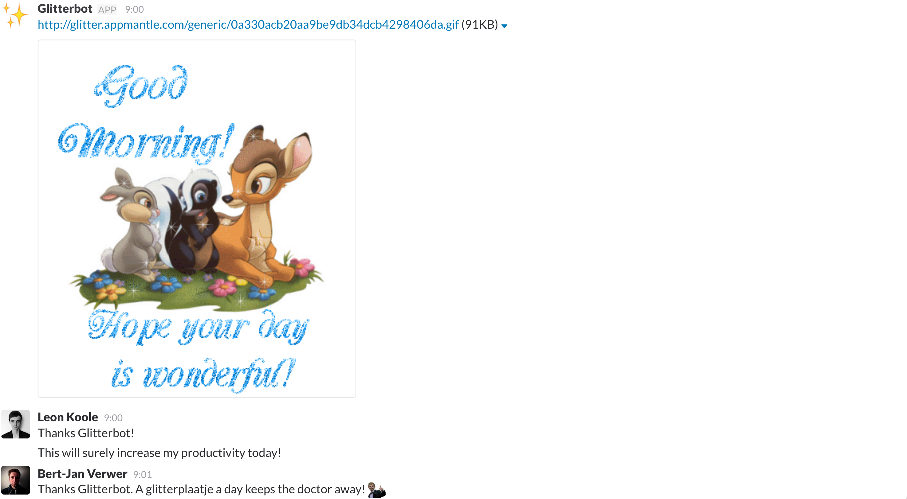

# Glitterbot ✨

Glitterbot is a free and open source [Slack](http://slack.com) bot. The bot improves your team's productivity by boosting your teams morale each morning. Glitterbot accomplishes this morale boost by posting a new Glitterplaatje at the start of each day.

### After adopting Glitterbot, how much more productive is your team?

> Glitterbot has greatly improved our teams morale. It makes our employees feel like their work has a higher purpose. Each new Glitterplaatje gives us a way to to recognize our team members for a job well done.
>
> _- Bert-Jan Verwer_

### What Glitterbot looks like

## Usage
You can host the Glitterplaatjes on your own web server, or use the Appmantle Glitter CDN as the source for the images. The Glitter CDN will always be up-to-date allowing you and your team to receive the latest and greatest Glitterplaatjes.

This bot is written in JavaScript and requires Node.js to run.

### Setup
1. Create a new coming webhook on slack and select the channel you want your Glitterplaatjes to be send to
2. Clone Glitterbot to your own machine
3. Install all dependencies by running `npm install`
3. Open `glitterbot.js` and set the URL of the webhook you just made in `SLACK_WEBHOOK_URL`
4. Start the bot using `node glitterbot.js`

### Using your own images
If you don't like the Glitterplaatjes (What?!), Glitterbot can also send your team your own custom images. 

1. Replace the images in the `public` folder with your own images
  **Make sure to maintain the excisting folder structure.** Place images meant for specific days in the folders for these days (`public/mon` for monday, `public/tue` for tuesday). Place generic images that could be sent on any morning in the `public/generic` folder.
2. Run `node images.js` to generate a new `images.json` for your images.
3. Upload the images.json file and all images to your own server
4. Change the path of the image host to your own server in `glitterbot.js`

### Configuration
In glitterbot.js you can change these settings:
Setting | Usage
`SLACK_WEBHOOK_URL` | The URL of your incoming Slack webhook. You can configure these for in the [Slack App Directory](slack.com/apps/manage/custom-integrations)
`IMAGE_SOURCE` | The path to where images.json and all images are hosted. By default this is our Glitter CDN.
`CRON` | The CRON expression used determine when Glitterplaatjes should be sent. By default this is on weekdays at 9:00. If you want to receive Glitterplaatjes every day, change this to `00 09 * * *`.

## Contributing
### Adding new Glitterplaatjes
1. Fork the repository on Github
2. Clone the repo to your own machine
3. Add your own Glitterplaatjes to the correct folders
4. Install dependencies by running `npm install`
5. run `node images.js` to generate an updated `images.json` with your new Glitterplaatjes
6. Commit these changes to your own branch
7. Push your work back to your fork on GitHub
8. Submit a pull request to our repository

### Improving code
At Appmantle, we're always open to outside contributions to our projects. If you've ran into a bug or have found any code or documentation to improve, feel free to make a pull request with a bugfix or other improvements. If you don't know how to fix a bug yourself, just open a new issue and we'll try to fix it.
